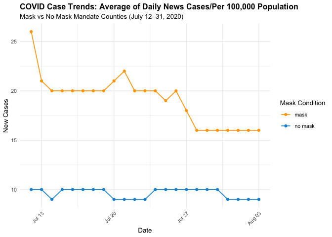

Lab 07 - Conveying the right message through visualisation
================
Allison Li
03252025

### Load packages and data

``` r
library(tidyverse) 
```

### Exercise 1

``` r
covid_mask <- tribble(
  ~date, ~count, ~mask_condition,
  "7/12/2020", 26, "mask",
  "7/13/2020", 21, "mask",
  "7/14/2020", 20, "mask",
  "7/15/2020", 20, "mask",
  "7/16/2020", 20, "mask",
  "7/17/2020", 20, "mask",
  "7/18/2020", 20, "mask",
  "7/19/2020", 20, "mask",
  "7/20/2020", 21, "mask",
  "7/21/2020", 22, "mask",
  "7/22/2020", 20, "mask",
  "7/23/2020", 20, "mask",
  "7/24/2020", 20, "mask",
  "7/25/2020", 19, "mask",
  "7/26/2020", 20, "mask",
  "7/27/2020", 18, "mask",
  "7/28/2020", 16, "mask",
  "7/29/2020", 16, "mask",
  "7/30/2020", 16, "mask",
  "8/1/2020", 16, "mask",
  "8/2/2020", 16, "mask",
  "8/3/2020", 16, "mask",
  "7/31/2020", 16, "mask",
  "7/12/2020", 10, "no mask",
  "7/13/2020", 10, "no mask",
  "7/14/2020", 9, "no mask",
  "7/15/2020", 10, "no mask",
  "7/16/2020", 10, "no mask",
  "7/17/2020", 10, "no mask",
  "7/18/2020", 10, "no mask",
  "7/19/2020", 10, "no mask",
  "7/20/2020", 9, "no mask",
  "7/21/2020", 9, "no mask",
  "7/22/2020", 9, "no mask",
  "7/23/2020", 9, "no mask",
  "7/24/2020", 10, "no mask",
  "7/25/2020", 10, "no mask",
  "7/26/2020", 10, "no mask",
  "7/27/2020", 10, "no mask",
  "7/28/2020", 10, "no mask",
  "7/29/2020", 10, "no mask",
  "7/30/2020", 10, "no mask",
  "7/31/2020", 9, "no mask",
  "8/1/2020", 9, "no mask",
  "8/2/2020", 9, "no mask",
  "8/3/2020", 9, "no mask"
)
```

To create the dataset, I created three variables, including the date,
mask_condition which indicate whether case is mask or no mask, and the
case number for each date and condition. I have them created based on my
guesses on the number in the original graph and the dates from 7/12/2020
to 7/31/2020.

### Exercise 2

``` r
covid_mask <- covid_mask %>%
  mutate(date = mdy(date)) %>%
  arrange(mask_condition, date)

ggplot(covid_mask, aes(x = date, y = count, color = mask_condition)) +
  geom_line(size = .6) +
  geom_point(size = 1.5) +
  scale_color_manual(values = c("mask" = "#ffa500", "no mask" = "#1392d3")) +
  labs(
    title = "COVID Case Trends: Average of Daily News Cases/Per 100,000 Population",
    subtitle = "Mask vs No Mask Mandate Counties (July 12–31, 2020)",
    x = "Date",
    y = "New Cases",
    color = "Mask Condition"
  ) +
  theme_minimal(base_size = 10) +
  theme(
    plot.title = element_text(face = "bold"),
    axis.text.x = element_text(angle = 45, hjust = 1)
  )
```

    ## Warning: Using `size` aesthetic for lines was deprecated in ggplot2 3.4.0.
    ## ℹ Please use `linewidth` instead.
    ## This warning is displayed once every 8 hours.
    ## Call `lifecycle::last_lifecycle_warnings()` to see where this warning was
    ## generated.

<!-- -->

In this re-graphed line graph, it is clear that the no mask condition
has less new cases reported from july 12th to july 31st. This graph has
the same y axis scale (number of cases reported) for both conditions
(mask and no mask countie).

### Exercise 3

In my visualization, it is clear that no mask mandate counties reported
less new covid cases each day comparing with mask mandate counties.
Although the mask mandate counties have a general trend of decreasing
reported new covid cases, they still have more covid cases reported.

### Exercise 4

I believe this graph and data indicated that wearing mask can
effectively prevent covid spreading, since the trend in the mask mandate
group is obviously a decreasing line, suggesting that over the month
less and less people are diagnosed as having covid. As for the no mask
mandate group, although in general it has less reported cases over the
month, the number of new cases reported remained almost the same, which
indicate that covid is still spreading as fast as before in those
counties.

### Exercise 5

The key factors including the scale of the axes, which my accurate
visualization has corrected to make both condition using the same X axis
scale. In addition, using line graph enables the audience to see the
trends of reported cases over the month and understand that wearing mask
might be able to help decrease the spreading of covid. The variable used
is the date and two counties, and the date helps the audience to
understand the effect of mask over time.

### Exercise 6

My opposite message would be: mask does not help preventing the
spreading of covid, and there is no difference between wearing mask
counties and mask not mandate counties. Therefore, one way I can do is
to extract one period of dates from the original data (July 14 to July
21) to show that wearing mask not only does not have influence on
preventing the spread of covid, but also increased the number of new
covid cases reported. In addition, I can also make a bar graph showing
the total amount of new cases reported for July, comparing the new covid
cases reported by mask mandate VS no mask mandate counties to indicate
that wearing mask does not help prevent but also worsen the spread of
covid.

### Exercise 7

``` r
## line graph
str(covid_mask)
```

    ## tibble [46 × 3] (S3: tbl_df/tbl/data.frame)
    ##  $ date          : Date[1:46], format: "2020-07-12" "2020-07-13" ...
    ##  $ count         : num [1:46] 26 21 20 20 20 20 20 20 21 22 ...
    ##  $ mask_condition: chr [1:46] "mask" "mask" "mask" "mask" ...

``` r
covid_filtered <- covid_mask %>%
  filter(date >= as.Date("2020-07-14") & date <= as.Date("2020-07-21"))

ggplot(covid_filtered, aes(x = date, y = count, group = mask_condition, color = mask_condition)) +
  geom_line(size = 1) +
  geom_point(size = 2) +
  scale_color_manual(values = c("mask" = "#ffa500", "no mask" = "#1392d3")) +
  labs(
    title = "COVID Case Trends in One Week: July 14–21, 2020",
    subtitle = "Mask vs No Mask Mandate Counties",
    x = "Date",
    y = "New Cases",
    color = "Condition"
  ) +
  theme_minimal(base_size = 10) +
  theme(
    plot.title = element_text(face = "bold", size = 12),
    plot.subtitle = element_text(size = 10),
    axis.text.x = element_text(angle = 45, hjust = 1, size = 8),
    axis.text.y = element_text(size = 8),
    legend.title = element_text(size = 9),
    legend.text = element_text(size = 8)
  )
```

<!-- -->

``` r
## Bar graph
total_cases <- covid_mask %>%
  group_by(mask_condition) %>%
  summarise(total_cases = sum(count))

ggplot(total_cases, aes(x = mask_condition, y = total_cases, fill = mask_condition)) +
  geom_bar(stat = "identity", width = 0.5) +
  scale_fill_manual(values = c("mask" = "#ffa500", "no mask" = "#1392d3")) +
  labs(
    title = "Total COVID Cases: Mask vs No Mask Counties",
    subtitle = "From July 12 to August 3, 2020",
    x = "Condition",
    y = "Total Cases",
    fill = "Condition"
  ) +
  theme_minimal(base_size = 12) +
  theme(
    plot.title = element_text(face = "bold", size = 14),
    plot.subtitle = element_text(size = 11),
    axis.text = element_text(size = 10)
    )
```

<!-- -->
